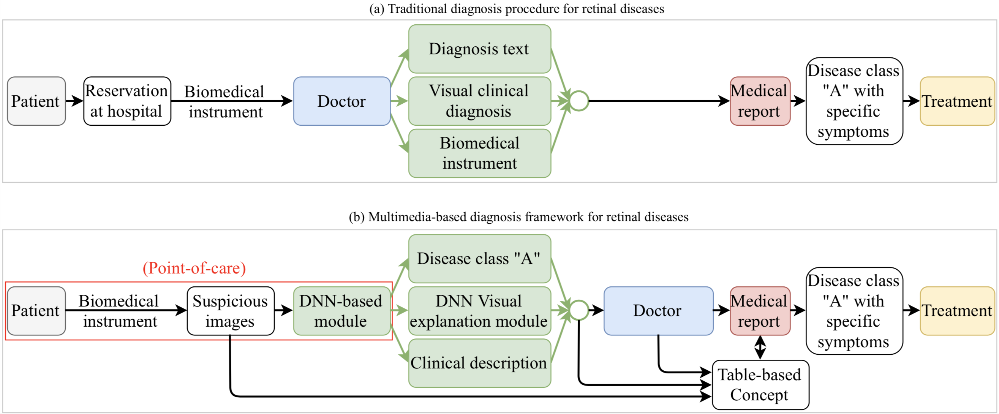

# DeepEyeNet

"DeepOpht: Medical Report Generation for Retinal Images via Deep Models and Visual Explanation"; Jia-Hong Huang, C.-H. Huck Yang, Fangyu Liu, Meng Tian, Yi-Chieh Liu, Ting-Wei Wu, I-Hung Lin, Kang Wang, Hiromasa Morikawa, Hernghua Chang, Jesper Tegner, and Marcel Worring; Proceedings of the IEEE/CVF Winter Conference on Applications of Computer Vision (WACV), 2021, pp. 2442-2452.

Click [here](https://openaccess.thecvf.com/content/WACV2021/html/Huang_DeepOpht_Medical_Report_Generation_for_Retinal_Images_via_Deep_Models_WACV_2021_paper.html) to read the DeepEyeNet paper. 

Open-access DeepEyeNet (DEN) Dataset request email for Terms of Use/Non-disclosure agreement (NDA): deepeyenet.den@gmail.com

**Keywords**: Vision and Language, Medical Image Captioning/Medical Report Generation, Large-scale Retinal Images Dataset

## Dataset Examples
Each image in the dataset has three types of expert-defined annotations, i.e., name of diseases/symptoms, keywords, and clinical description.

## Dataset Visualization - Venn-style word cloud

## Flowchart of the proposed method

## Retinal disease treatment procedure

## Dataset format

Two examples from the DeepEyeNet dataset json file:
The key "eyenet0420/train_set/suspected-multiple-evanescent-white-dot-syndrome-4.jpg" is YOUR-PATH + a name of disease.
The corresponding value of the key {"keywords": "uveitis, dry age-related macular degeneration (dry amd), punctate inner choroidopathy (pic), multiple evanescent white dot syndrome (mewds)", "clinical-description": "20 degree view, red free image of left macula of a 28-year-old caucasian female."} is a dictionary. It contains two dictionaries, i.e., the keys "keywords" and "clinical-description" with the corresponding vlaues "uveitis, dry age-related macular degeneration (dry amd), punctate inner choroidopathy (pic), multiple evanescent white dot syndrome (mewds)" and "20 degree view, red free image of left macula of a 28-year-old caucasian female.", respectively.

[

  {
    "eyenet0420/train_set/suspected-multiple-evanescent-white-dot-syndrome-4.jpg": {
      "keywords": "uveitis, dry age-related macular degeneration (dry amd), punctate inner choroidopathy (pic), multiple evanescent white dot syndrome (mewds)",
      "clinical-description": "20 degree view, red free image of left macula of a 28-year-old caucasian female."},
    
    "eyenet0420/train_set/group41-177.jpg": {
      "keywords": "macular hole",
      "clinical-description": "43-year-old female, macular hole."}
  }
  
]
