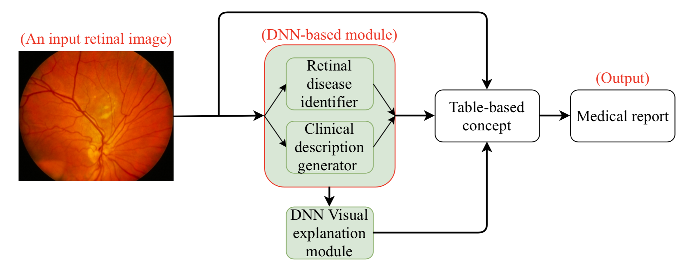

# DeepOpht

- Medical-Report-Generation-for-Retinal-Images-via-Deep-Models-and-Visual-Explanation (accepted by WACV-2021)

Paper: https://arxiv.org/abs/2011.00569, IEEE WACV 2021

Dataset request email for NDA: jiahong.huang@kaust.edu.sa

## Dataset Demo

## Words Cloud

## Flowchart of the proposed method:

